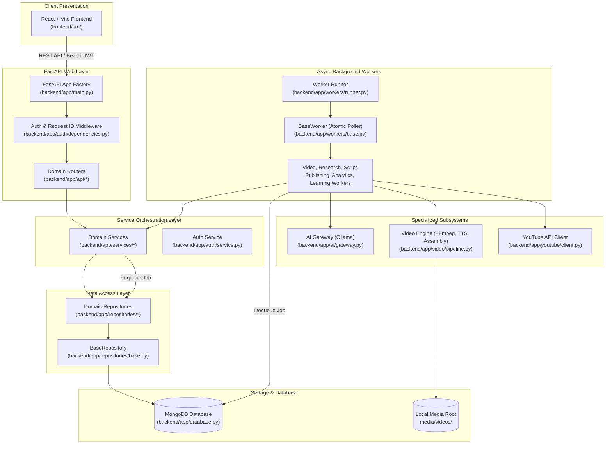

# Architecture Overview

**Analysis Date:** 2026-09-10

## Architectural Pattern

Auvyra follows a **Decoupled Modular Layered Architecture** with an **Asynchronous Job-Worker Pipeline** and **Isolated Subsystems**:

1. **Layered Separation of Concerns**: Clean progression from Web/Presentation (`frontend/src/`) -> HTTP/REST API (`backend/app/api/`) -> Business Services (`backend/app/services/`) -> Data Access Repositories (`backend/app/repositories/`) -> MongoDB Database.
2. **MongoDB-Backed Atomic Task Queue**: Long-running computational processes (AI generation, video rendering, YouTube publishing, analytics sync, channel learning) are dispatched as asynchronous jobs via `backend/app/repositories/jobs.py` and polled atomically (`find_one_and_update`) by decoupled background workers (`backend/app/workers/`).
3. **Black-Box Video Subsystem**: Video production is encapsulated within `backend/app/video/`, exposing a unified facade (`VideoGenerationService` in `backend/app/video/pipeline.py`) so upstream services have zero direct coupling to FFmpeg, Edge-TTS, or media scraping libraries.
4. **Local-First AI Gateway**: Large language model calls are channeled through `backend/app/ai/gateway.py`, enforcing Pydantic schema validation, regex JSON repair, and multi-turn retry loops against local Ollama instances (with zero mandatory cloud LLM dependencies).
5. **Multi-Tenant Scoped Data Access**: Every data query and mutation in `backend/app/repositories/base.py` enforces tenant ownership (`user_id`), preventing cross-tenant information leakage.



---

## System Layers & Boundaries

### 1. Frontend Layer (`frontend/src/`)
- **Technology**: React 18, Vite, TypeScript, Tailwind CSS, React Router v6, Axios, Lucide React, React Hot Toast.
- **Role**: Single Page Application (SPA) providing dashboard controls, channel configuration, topic research exploration, video creation wizards, and analytics visualizations.
- **Boundaries**:
  - Interacts exclusively with `/api/*` via the centralized HTTP client (`frontend/src/api/client.ts`).
  - Manages JWT access and refresh tokens in `localStorage` with an automated axios response interceptor for refresh cycles.
  - Polls asynchronous job progress via `usePolling` hook (`frontend/src/hooks/usePolling.ts`).
  - Never directly performs business logic, video generation, or database calls.

### 2. API Layer (`backend/app/api/`, `backend/app/auth/`)
- **Technology**: FastAPI, Pydantic v2, Starlette, HTTPBearer.
- **Key Files**:
  - `backend/app/main.py`: Application factory, CORS configuration, security header middlewares, central structured error handlers (`HTTPException`, `RequestValidationError`), health check endpoints (`/api/health*`), static file mount (`/media`).
  - `backend/app/auth/router.py`: Registration, login, token refresh, Google OAuth callback endpoints.
  - `backend/app/auth/dependencies.py`: `require_auth` dependency extracting and validating JWT tokens. Never trusts frontend-supplied user IDs.
  - `backend/app/api/channels.py`: YouTube and internal channel CRUD and autopilot toggle.
  - `backend/app/api/content.py`: Idea generation, listing, script drafting.
  - `backend/app/api/research.py`: Topic research reports and opportunities.
  - `backend/app/api/videos.py`: Video generation requests, listing, streaming (`HTTP 206 Partial Content`), downloads.
  - `backend/app/api/publishing.py`: Manual or automated YouTube publishing triggers.
  - `backend/app/api/analytics.py`: Channel snapshots and strategic insight retrieval.
  - `backend/app/api/jobs.py`: Asynchronous job status polling.

### 3. Service Layer (`backend/app/services/`)
- **Role**: Pure business logic orchestrators. They manage transactions, enforce invariants, invoke repositories, and coordinate specialized subsystems.
- **Key Services**:
  - `backend/app/services/video_service.py` (`VideoService`): Validates channel permissions, persists video metadata, enqueues background jobs, and executes the video rendering pipeline.
  - `backend/app/services/content_service.py` (`ContentService`): Manages idea generation and multi-hook structured script drafting.
  - `backend/app/services/research_service.py` (`ResearchService`): Gathers market gaps, why-now rationales, and content opportunities via AI.
  - `backend/app/services/publishing_service.py` (`PublishingService`): Decrypts stored Google OAuth tokens with Fernet and coordinates YouTube uploads.
  - `backend/app/services/analytics_service.py` (`AnalyticsService`): Ingests metrics snapshots and computes trend evaluations.
  - `backend/app/services/learning_service.py` (`LearningService`): Analyzes audience retention and updates long-term channel memory.
  - `backend/app/services/channel_service.py` (`ChannelService`): Channel profile management and YouTube sync.
  - `backend/app/auth/service.py` (`AuthService`): Password hashing (bcrypt), token issuance, Google OAuth token exchange.

### 4. Repository Layer (`backend/app/repositories/`)
- **Technology**: Motor (`AsyncIOMotorDatabase`), PyMongo, BSON.
- **Key Files**:
  - `backend/app/repositories/base.py` (`BaseRepository`): Common CRUD abstractions with mandatory `user_id` scoping to prevent cross-tenant data leaks. Safe `ObjectId` conversion.
  - `backend/app/repositories/channels.py` (`ChannelRepository`, `ChannelMemoryRepository`): Channel configuration and continuous learning memory.
  - `backend/app/repositories/jobs.py` (`JobRepository`): Atomic queue operations (`enqueue`, `dequeue`, `update_progress`, `retry_failed`, `recover_stale_jobs`).
  - `backend/app/repositories/videos.py` (`VideoRepository`, `VideoAssetRepository`): Video metadata and constituent asset paths (audio, subtitles, source clips).
  - `backend/app/repositories/content.py` (`ContentIdeaRepository`, `ScriptRepository`): Ideas and generated scripts.
  - `backend/app/repositories/research.py` (`ResearchRepository`): Market research reports.
  - `backend/app/repositories/publishing.py` (`PublishingRepository`): Publishing job tracking.
  - `backend/app/repositories/analytics.py` (`AnalyticsRepository`, `StrategyInsightRepository`): Snapshot storage and insights.
  - `backend/app/repositories/memory.py` (`AgentRunRepository`): Audit log of AI agent executions.
  - `backend/app/repositories/users.py` (`UserRepository`, `OAuthAccountRepository`): Accounts and encrypted third-party credentials.
- **Note**: Compatibility shims (`channel.py`, `job.py`, `video.py`, `agent.py`) re-export classes from their canonical files.

### 5. Worker Layer (`backend/app/workers/`)
- **Technology**: Python `asyncio`, Motor, Loguru.
- **Architecture**:
  - `backend/app/workers/base.py` (`BaseWorker`): Base class implementing an atomic polling loop on MongoDB's `jobs` collection. Includes retry tracking (`max_attempts=3`) and automated recovery of crashed/stale jobs (`recover_stale_jobs`).
  - `backend/app/workers/runner.py`: CLI entry point (`python -m backend.app.workers.runner`) managing graceful shutdown (`SIGINT`/`SIGTERM`) and concurrent execution of all worker tasks.
  - Concrete workers:
    - `backend/app/workers/video_worker.py` (`VideoWorker`): Handles `video_generation` jobs.
    - `backend/app/workers/research_worker.py` (`ResearchWorker`): Handles `research` jobs.
    - `backend/app/workers/script_worker.py` (`ScriptWorker`): Handles `script_generation` jobs.
    - `backend/app/workers/publishing_worker.py` (`PublishingWorker`): Handles `publishing` jobs.
    - `backend/app/workers/analytics_worker.py` (`AnalyticsWorker`): Handles `analytics_sync` jobs.
    - `backend/app/workers/learning_worker.py` (`LearningWorker`): Handles `learning` jobs.

### 6. AI Gateway (`backend/app/ai/`)
- **Technology**: OpenAI Python SDK (`AsyncOpenAI` pointing to Ollama's `/v1` endpoint), Pydantic v2.
- **Key Files**:
  - `backend/app/ai/gateway.py` (`AIGateway`): Wraps local Ollama instance. Enforces strict schema decoding with markdown/codeblock stripping, bracket balancing regex extraction, and automatic feedback-driven retry correction (`_chat_json`).
  - `backend/app/ai/prompts.py`: Standardized system prompts for script generation, hook evaluation, content idea discovery, performance analysis, and strategic insight creation.

### 7. Video Engine Subsystem (`backend/app/video/`)
- **Technology**: FFmpeg, FFprobe, Edge-TTS, AsyncIO.
- **Key Modules**:
  - `backend/app/video/pipeline.py` (`VideoGenerationService`): Pipeline orchestrator handling the full 8-step lifecycle (Init -> Script Assets -> Media Sourcing -> Narration Synthesis -> Subtitle Generation -> Video Assembly -> FFmpeg Composition -> Metadata Probing).
  - `backend/app/video/tasks/manager.py` (`VideoTaskManager`): Standardized progress reporting (0% to 100%).
  - `backend/app/video/media/`: Pluggable media acquisition (`PexelsProvider` for stock footage, `LocalMediaProvider` for offline-first solid color/pattern backgrounds).
  - `backend/app/video/audio/`: Voice synthesis via `EdgeTTSProvider` and duration analysis via `duration.py`.
  - `backend/app/video/subtitles/`: SRT generation (`generator.py`), validation, and timing alignment (`srt_parser.py`, `corrector.py`).
  - `backend/app/video/composition/`: Clip concatenation and aspect-ratio scaling (`assembler.py`), text/audio overlay filtergraph rendering (`overlay.py`).
  - `backend/app/video/rendering/ffmpeg.py`: Low-level FFmpeg process invocation and media probing.

---

## Data Flow & Lifecycle

The end-to-end lifecycle follows a 7-stage closed feedback loop:

```
[1. Research] ──> [2. Script] ──> [3. Storyboard] ──> [4. Video] ──> [5. Publish] ──> [6. Analytics] ──> [7. Learn]
      ▲                                                                                                    │
      └──────────────────────── Channel Memory & Strategy Insights ────────────────────────────────────────┘
```

### Stage 1: Research (`ResearchService` & `ResearchWorker`)
1. User or schedule requests topic research for a channel.
2. `ResearchService.create_research()` invokes `AIGateway.generate_research_opportunity()`.
3. AI generates structured research matching `ResearchOpportunity` (why-now angle, audience signals, content gaps, hooks).
4. Persisted into MongoDB `research_reports` collection.

### Stage 2: Script (`ContentService` & `ScriptWorker`)
1. Content opportunity or manual topic is selected for scripting.
2. `ContentService.generate_script()` calls `AIGateway.generate_structured_script()`.
3. AI produces multiple hook candidates, evaluates hook engagement scores, outlines narrative beats, generates call-to-action (CTA), and writes narration text bounded by duration (approx. 2.3 words/sec).
4. Validated via `StructuredScript` and persisted in `scripts` collection.

### Stage 3: Storyboard & Visual Search (`VideoGenerationService`)
1. Narration script is analyzed by `AIGateway.generate_search_terms()` to extract semantic visual queries.
2. `VideoGenerationService` resolves media provider (`PexelsProvider` with fallback to `LocalMediaProvider`).
3. Appropriate visual clips matching target aspect ratio (`9:16`, `16:9`, or `1:1`) are retrieved and downloaded.

### Stage 4: Video Generation (`VideoService` & `VideoWorker`)
1. Client POSTs to `/api/videos/generate`, creating a record in `videos` and queuing a `video_generation` job.
2. `VideoWorker` picks up the job and invokes `VideoService.process_video_job()`.
3. Pipeline executes 8 sequential phases:
   - `0% INITIALIZING`: Prepare working directory.
   - `10% SCRIPT_ASSETS`: Format script and keywords.
   - `25% FINDING_MEDIA`: Download/gather video footage.
   - `40% GENERATING_NARRATION`: Synthesize audio via Edge-TTS.
   - `55% GENERATING_SUBTITLES`: Build word-timed `.srt` file.
   - `70% COMPOSING_VIDEO`: Trim and concatenate clips to match voiceover duration.
   - `90% RENDERING`: FFmpeg burns subtitles, mixes audio/BGM, and renders final MP4.
   - `100% COMPLETED`: Probe final dimensions/size, move file to `media/videos/{channel_id}/{video_id}.mp4`, update database.
4. Client polls job status via `/api/jobs/{job_id}` or streams result via `/api/videos/{video_id}/stream`.

### Stage 5: Publish (`PublishingService` & `PublishingWorker`)
1. Video is approved for publication.
2. `PublishingService` decrypts stored Google OAuth tokens using Fernet symmetric encryption (`Settings.get_fernet()`).
3. If OAuth credentials are missing, publication halts gracefully with structured error `GOOGLE_OAUTH_NOT_CONFIGURED`.
4. If valid, `YouTubeClient` uploads media via YouTube Data API v3 resumable upload, setting title, description, tags, and visibility.
5. Video status updates to `published` with `youtube_video_id`.

### Stage 6: Analytics (`AnalyticsService` & `AnalyticsWorker`)
1. Worker or manual sync pulls YouTube performance data (views, likes, comments, watch time, CTR, retention).
2. Data stored as point-in-time documents in `analytics_snapshots` collection.
3. Accessible to frontend for dashboard reporting via `/api/analytics/channel/{channel_id}`.

### Stage 7: Learn & Strategy Evolution (`LearningService` & `LearningWorker`)
1. `LearningService.update_channel_memory()` aggregates historical snapshots.
2. `AIGateway.generate_strategy_insights()` analyzes top-performing vs under-performing content.
3. Updates `channel_memory` with high-converting topics, winning hooks, and optimal duration bands.
4. Future runs of Stage 1 (Research) and Stage 2 (Script) inject `channel_context` from memory, closing the self-improving loop.

---

## Core Abstractions

| Abstraction | File Location | Purpose |
|-------------|---------------|---------|
| `BaseRepository` | `backend/app/repositories/base.py` | Universal MongoDB CRUD base providing automated timestamps, safe `ObjectId` handling, and multi-tenant security filters. |
| `BaseWorker` | `backend/app/workers/base.py` | Asynchronous worker loop abstracting atomic job polling, progress reporting, retry handling, and stale task recovery. |
| `AIGateway` | `backend/app/ai/gateway.py` | Resilient interface for LLM inference featuring schema validation, JSON sanitization, and multi-turn error correction. |
| `VideoGenerationService` | `backend/app/video/pipeline.py` | High-level facade for end-to-end video synthesis encapsulating TTS, media fetching, and FFmpeg composition. |
| `MediaProvider` | `backend/app/video/media/base.py` | Abstract interface for sourcing video assets (`PexelsProvider`, `LocalMediaProvider`). |
| `TTSProvider` | `backend/app/video/audio/base.py` | Abstract interface for text-to-speech audio synthesis (`EdgeTTSProvider`). |
| `YouTubeClient` | `backend/app/youtube/client.py` | Wrapper for YouTube Data API v3 handling resumable video uploads and channel metadata retrieval. |
| `LocalStorageProvider` | `backend/app/storage/local.py` | Abstraction for storing, retrieving, and streaming media files from the host filesystem. |
| `Settings` | `backend/app/config.py` | Pydantic BaseSettings managing application configuration, environment validation, and Fernet encryption. |

---

## Entry Points

### 1. HTTP API Server
- **Path**: `backend/app/main.py`
- **Command**: `uvicorn backend.app.main:app --host 0.0.0.0 --port 8000 --reload`
- **Lifespan**: Initializes MongoDB connection pool (`db_manager.connect()`), creates indexes (`db_manager.create_indexes()`), mounts routers and media directories.

### 2. Background Worker Runner
- **Path**: `backend/app/workers/runner.py`
- **Command**: `python -m backend.app.workers.runner` (or selectively via `--workers video_generation publishing`)
- **Lifecycle**: Connects to MongoDB, spawns asynchronous polling tasks for each configured worker class, traps `SIGINT`/`SIGTERM` for graceful teardown.

### 3. Frontend Web Application
- **Path**: `frontend/src/main.tsx` & `frontend/src/App.tsx`
- **Command**: `npm run dev` (Vite dev server on port 5173)
- **Lifecycle**: Mounts React tree, initializes `AuthProvider` with token check, registers React Router routes and notification toaster.

### 4. Verification & Diagnostic Scripts
- **Path**: `scripts/dev.sh`: Spawns backend, worker, and frontend concurrently.
- **Path**: `scripts/verify.sh`: Executes backend pytest suite and frontend TypeScript compilation.
- **Path**: `scripts/doctor.py`: Validates environment requirements (Python 3.11+, Node.js, MongoDB, Ollama, FFmpeg).

---

## Architectural Constraints

1. **Mandatory Multi-Tenant Scoping**: All repository queries involving user assets MUST filter by `user_id` sourced directly from the verified JWT in `backend/app/auth/dependencies.py`. Frontend-supplied user IDs in request bodies must never be trusted.
2. **Local-First AI Resilience**: The system must run completely on local models (`Ollama`) without hard external dependencies on proprietary paid APIs. When Ollama is unreachable, endpoints must report degraded health or return structured `OLLAMA_UNAVAILABLE` errors.
3. **Graceful Degradation for Stock Media**: If `PEXELS_API_KEY` is not provided or API calls fail, the video pipeline must automatically fall back to `LocalMediaProvider` without crashing.
4. **Token Encryption at Rest**: Sensitive OAuth access and refresh tokens stored in MongoDB must be encrypted using Fernet symmetric encryption (`Settings.get_fernet()`).
5. **Deterministic Error Responses**: All API errors must conform to the standard error envelope:
   ```json
   {
     "error": {
       "code": "ERROR_CODE",
       "message": "Human readable description",
       "details": null,
       "request_id": "uuid"
     }
   }
   ```
6. **No Leaked Stack Traces**: Raw Python tracebacks must never be exposed to clients; unhandled exceptions must be caught and logged by `backend/app/main.py`.

---

## Anti-Patterns & Boundaries

- **No Direct FFmpeg Execution Outside Video Subsystem**: Never call `ffmpeg` subprocesses from API routers, services, or workers. All rendering must go through `backend/app/video/`.
- **No Direct Database Access from Controllers**: API routers in `backend/app/api/` must delegate business operations to domain services rather than directly querying collections.
- **No Synchronous Heavy Work in Request-Response Cycle**: Video rendering, model training, and bulk media downloads must never execute synchronously within an HTTP request. They must be enqueued as jobs and polled.
- **No Unvalidated LLM Output**: LLM completions must not be written directly into the database without first passing Pydantic schema validation (`model_validate`).
- **No Hardcoded Environment Credentials**: Secrets, database URIs, and encryption keys must never be hardcoded; they must resolve through `backend/app/config.py`.

---
*Architecture analysis: 2026-09-10*
